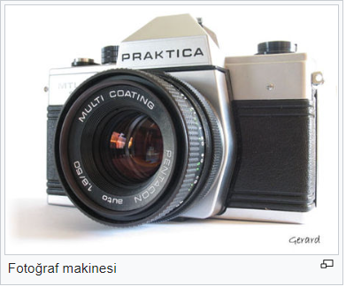
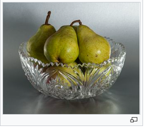

Veriseti yaklaşık 260.000 tane fotoğrafın url'i ve o resme karşılık gelen metni barındırıyor.

Veriseti, https://arxiv.org/abs/2103.01913 makalesindeki toplanan veriler işlenerek oluşturulmuştur.

## Veriyi Temizleme
- Sadece Türkçe veriler alındı.
- Alınan verilerde GIF,SVG gibi modeli eğitirken kullanmadığım fotoğraf türleri atıldı.(yaklaşık 5 bin fotoğraf)
- Bazı wikipedia sayfalarında fotoğrafların tanımları olmayabiliyor.(%50'sinde yok)
 <table>
  <tr>
    <td></td>
    <td></td>
  </tr>
  <tr>
    <td>Altında tanımı olan Wikipedia resmi </td>
     <td>Altında tanımı olmayan Wikipedia resmi</td>
  </tr>
 </table>
 
- Eğer tanımı yoksa o fotoğrafa karşılık gelen metni o sayfanın başlığından aldım.
- Bazı url'lerdeki fotoğraflar silinmişti. Silinen fotoğraflar tespit edilip çıkartıldı.

Şuanki verisetinde "url" ve "captions" olmak üzere iki sütun bulunuyor.
Verisetini [drive linkinden](https://drive.google.com/file/d/1NA1w-nA1wsoOoTncgifxF0CqttxygdBL/view?usp=sharing) indirebilirsiniz.

##  Diğer Kulanılabilir Verisetleri
Resim-Türkçe Metin şeklinde olan verisetleri mevcut. Bunlar Tasvir Et, Turkish MSCOCO ve Flickr30k. 

Tasvir Et veriseti 2016 yılında Hacettepe Üniversite'sinin yayınladığı bir [makalesinde](https://semihyagcioglu.com/projects/tasviret/) sunuldu. Bu verisetinde Flick8k verisetindeki fotoğrafların insanlar tarafından Türkçe tasvirleri yapıldı. Bu verisetindeki her bir fotoğrafa 2 tane tanım cümlesi oluşturuldu. Verisetinde yaklaış 8 bin fotoğraf ve 16 bin Türkçe metin var. Bu veriseti tamamen insanlar tarafından oluşturulduğundan cümleler anlamlı ve resimle tamamen örtüşüyor.

Turkish MSCOCO  veriseti 2017 yılında ["Çeviri Veriyle Image Captioning Modeli Oluşturulabilir mi?"](https://ieeexplore.ieee.org/abstract/document/7960638) makalesinde sunuldu. MSCOCO yaklaşık 84 bin fotoğraf içeriyor ve her bir fotoğraf için 5 tane İngilizce tanım cümlesi olan bir veriseti var. Turkish MSCOCO ise bu hazır İngilizce verisetini translate API kullanarak çevirdi. Bu da yaklaşık 420 bin çeviri Türkçe cümle demek. Her ne kadar veriler çeviri olsa da modelin bu verilerle iyi sonuçlar verdiğini gördüm. Bu veriyi makalenin [github sayfasında](https://github.com/giddyyupp/turkish-image-captioning) bulabilirsiniz.

Flickr 30k yine ["Çeviri Veriyle Image Captioning Modeli Oluşturulabilir mi?"](https://ieeexplore.ieee.org/abstract/document/7960638) makalesinde sunulan çeviri bir veriseti. İçerisinde 30 bin fotoğraf barındırıyor. [github sayfasından](https://github.com/giddyyupp/turkish-image-captioning) Türkçe json verisetini yükleyerek kullanabilirsiniz. Flickr 30k veriseti, Flickr8k verisetinin üzerine oluşturuldu. Yani bu verisetibi kullandığınızda Flickr8k verisetini dolayısıla Tasvir Et verisetini 

Bu verisetlerini kullanabilmek için resimleri indirmiş olmanız gerekiyor. 
